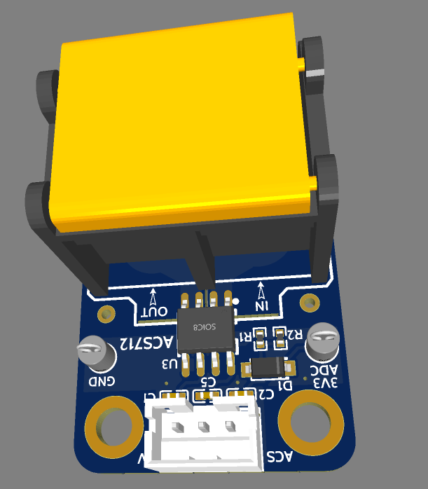
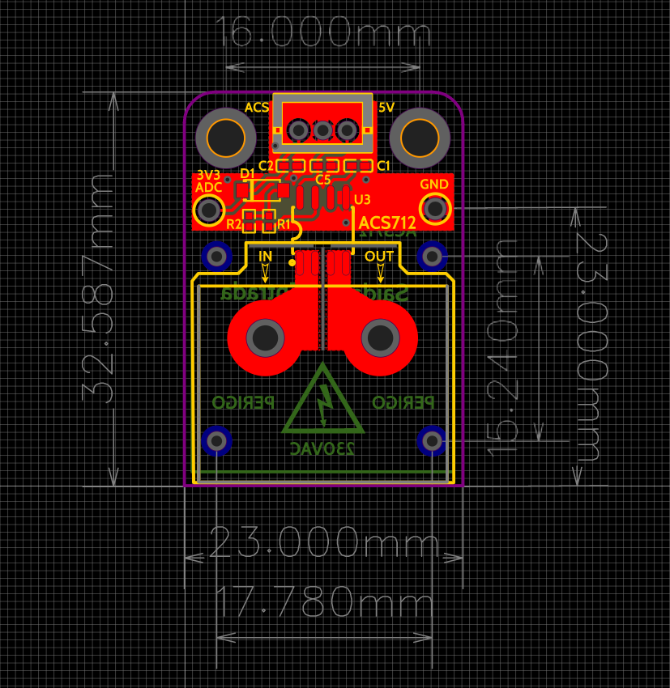

# Modulo-ACS712-20A-V3
Modulo  ACS712 para integração no ESPHome
Esquema, PCB e código Yaml.

O ACS712 é amplamente utilizado em diversas aplicações, incluindo:
Automação industrial: Monitorização de correntes de motores, fontes de alimentação e proteção contra sobrecarga.
Eletrônica de consumo: Monitorização de corrente de baterias em dispositivos portáteis e monitoramento de correntes em adaptadores de energia.
Energia renovável: Monitorização de corrente de painéis solares e de baterias.

ACS712 module for integration into ESPHome
Schematic, PCB and Yaml code.

The ACS712 is widely used in various applications, including: 
Industrial automation: Monitoring motor currents, power supply monitoring, and overload protection.
Consumer electronics: Monitoring battery current in portable devices, and monitoring currents in power adapters.
Renewable energy: Monitoring solar panel current and battery current.

Yaml code and components from:  https://github.com/marianomd/acs712-esphome/tree/main

